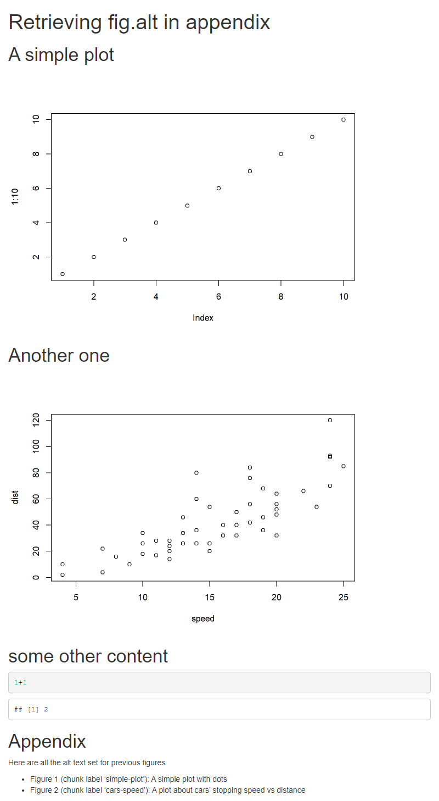

```{r setup, include = FALSE}
# https://github.com/rstudio/rmarkdown-cookbook/blob/master/utils.R
import_example <- function(file) {
  x <- xfun::read_utf8(file.path("examples", file))
  x <- rmarkdown:::partition_yaml_front_matter(x)
  fm <- c("````yaml", x$front_matter, "````")
  body <- c("````markdown", x$body, "````")
  knitr::asis_output(paste(c(fm, body), collapse = '\n'))
}
```


Recently, I was pinged on Twitter about a 'How to' with **rmarkdown** and **knitr**

```{r, echo = FALSE}
tweetrmd::tweet_embed("https://twitter.com/JuniperLSimonis/status/1408886794297307137", align = "center")
```

```{r, echo = FALSE}
tweetrmd::tweet_embed("https://twitter.com/benmarwick/status/1408910726580736000", hide_thread = TRUE, align = "center")
```

The idea is simple: 

::: {.center style="text-align:center"}
Can we retrieve all alternative texts set with `fig.alt` chunk option[^figaltopt] to display them in an appendix at the end of the document ? 
:::

[^figaltopt]: If you are not familiar with this chunk option, this is a new one added in knitr 1.32 to set alternative text on any figures inside code chunk. More about it on the [This blog post](https://blog.rstudio.com/2021/04/20/knitr-fig-alt/).

There is not a straightforward way but using a few **knitr** tricks, this can be done. Let's take this small example file: 

```{scss, echo = FALSE}
pre.yaml {
  margin: 0px;
  padding-bottom: 0px;
  border-bottom-style: none;
  
  code {
    padding-bottom: 0px;
  }
}

pre.yaml + pre.md, pre.yaml + pre.markdown {
  border-top-style: none;
  padding-top: 0px;
  
  code {
    padding-top: 0px;
  }
}
```


`r import_example("_without-appendix.Rmd")`

We would like to retrieve all the `fig.alt` set at the end of the document as a bullet point list. This can be done using advanced knitr features: 

* `knitr::all_labels()` which allows to retrieve all chunk labels in a document. You can find a usage example in the R Markdown Cookbook about how to [Put together all code in the appendix](https://bookdown.org/yihui/rmarkdown-cookbook/code-appendix.html#code-appendix)
* `knitr::knit_code` which allows to retrieve code content from any chunk using its labels. The object return contains chunk options in attributes. This [post by Emi Tanaka](https://emitanaka.rbind.io/post/knitr-knitr-code/) gives a nice introduction on what this can do. This is a really advanced feature to use with caution. See at leas `?knitr::knit_code` before using it!
* `result='asis'` and `knitr::knit_expand()` [to generate Rmd source from variable](https://bookdown.org/yihui/rmarkdown-cookbook/knit-expand.html). 

Putting this together, we would do first

* Retrieve the chunks with a `fig.alt` labels
* Retrieve the options set on these chunks to get the `fig.alt` one

```{r, include = FALSE}
res <- knitr::purl("examples/_with-appendix.Rmd")
knitr::read_chunk(res)
```

```{r retrieve-chunk-opt, eval = FALSE}
```

Then we would write our markdown content, for example using `knitr::knit_expand` as templating mechanism. We want something like this in markdown to obtain a list in HTML

````markdown
* Figure 1 (chunk label 'plot-1): An alt text
````

This would be generated by looping on selected chunk option to create these markdown strings.

```{r write-appendix, eval = FALSE}
```

The code above could be included in a single Rmd document like this, using the correct chunk option to hide the code and output the markdown strings as is.

`r import_example("_with-appendix.Rmd")`

After rendering, the resulting document would look like this 

```{r, include = FALSE}
tmp <- tempfile(fileext = ".html")
res <- xfun::Rscript_call(function(x) 
  rmarkdown::render("examples/_with-appendix.Rmd", 
                    output_file = x, quiet = TRUE), args = list(x = tmp))
res <- pagedown::chrome_print(res, format = "png")
file.copy(res, "output.png", overwrite = TRUE)
```

```{r, echo = FALSE, fig.alt = "resulting html document with appendix", out.extra="class='embeded-rmd'"}

```

```{css, echo = FALSE}
img.embeded-rmd {
  border-style: solid;
  border-color: grey;
}
```

```{=html}

```

This is a rather advanced solution using some of the less-known feature of **knitr**. I am sure there could also be another approach using the [**parsermd**](https://rundel.github.io/parsermd/) by [`@rundel`](https://github.com/rundel) which helps you parse a Rmd file, including chunk option. However, that would mean reading the Rmd file during rendering of the same Rmd file... but why not ! I let you try.

For more recipes about R Markdown, don't forget to read the [R Markdown Cookbook](https://bookdown.org/yihui/rmarkdown-cookbook/) from which some of the tricks here are based !


